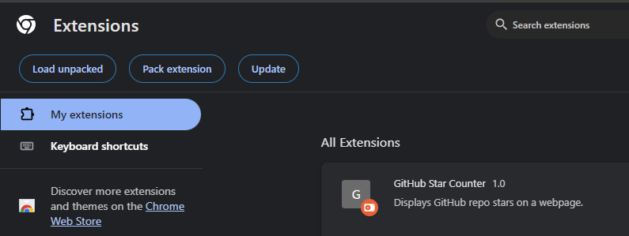
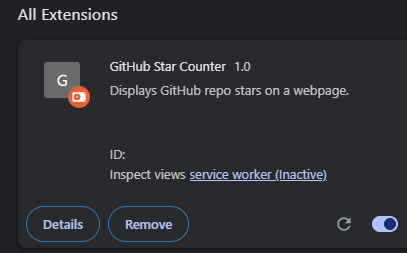
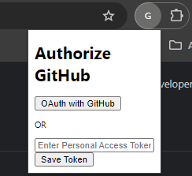
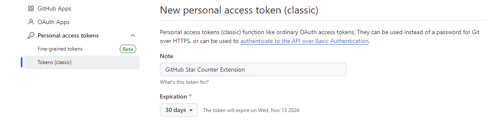

# GitHub Star Chrome Extension

## Overview
The GitHub Star Chrome Extension shows the number of stars for a repository.


## Installation
1. Choose a folder to save the Chrome extension.
2. Clone the repository:
    ```bash
    git clone https://github.com/xwy-bit/GithubStars.git
    ```
3. Open Chrome.
4. Go to `chrome://extensions/`.
5. Click the `Load unpacked` button.
    
6. Select the folder where the extension is saved.
7. The extension is now installed.
    

## Usage

1. Click the "oAuth with GitHub" button in the popup.
    
2. You will be redirected to GitHub settings to create a new personal access token.
    
    
3. Copy the token, paste it in the input box, and click the "Save Token" button.

4. Search for something to try it out!